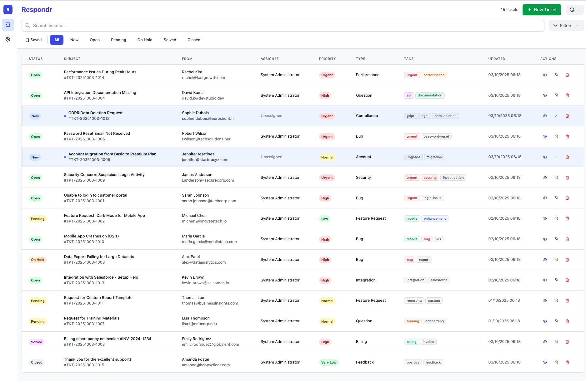
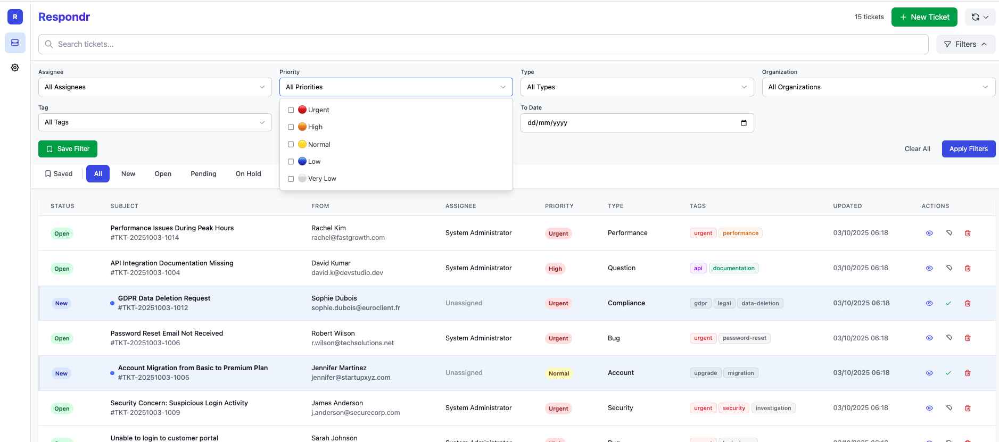
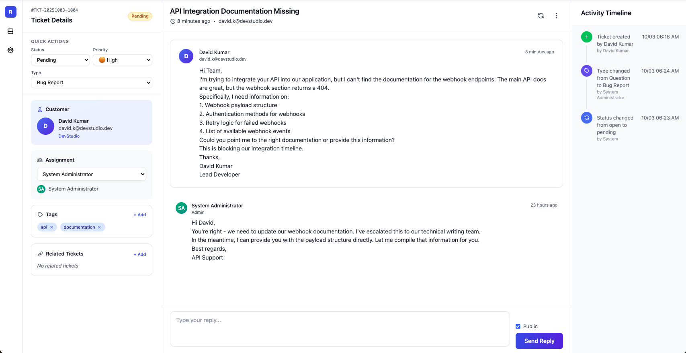
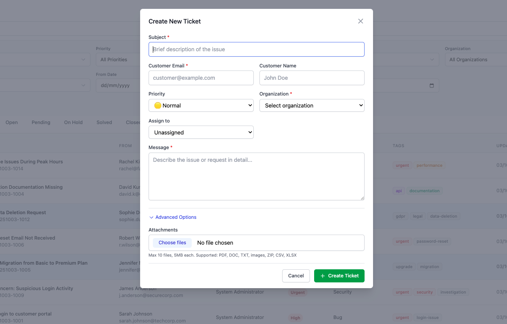
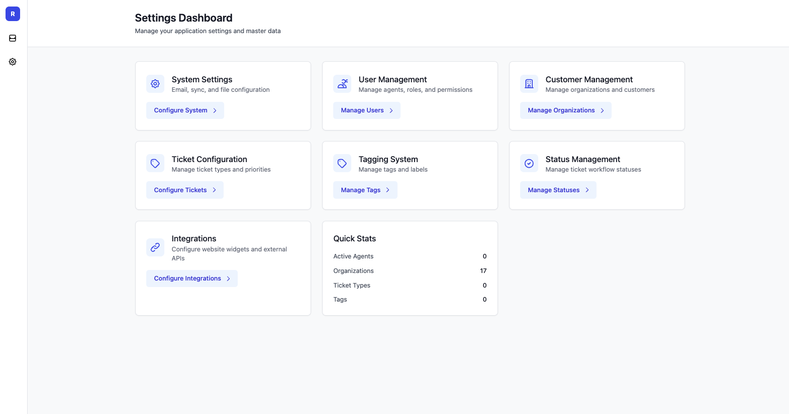

# Respondr - Modern Ticketing Platform

A comprehensive customer support and ticketing platform built with Python Flask. Currently in early development with email-to-ticket functionality as the foundation for a full-featured multi-channel support system.

## Current Status

**Version:** 0.1.0 (Early Development)

The project currently supports:
- ✅ Email-to-ticket conversion via IMAP
- ✅ Modern web interface with real-time updates
- ✅ Attachment handling and embedded images
- ✅ Basic ticket management (view, search, filter)
- ✅ Web-based configuration

## Screenshots

### Ticket List View

*Modern, minimalistic ticket list with status indicators and quick filters*

### Advanced Filtering

*Multi-select filters for status, priority, assignee, type, organization, and tags*

### Ticket Details

*Comprehensive ticket view with conversation history and quick actions*

### Create New Ticket

*Streamlined ticket creation form with all essential fields*

### Settings Dashboard

*Web-based configuration for email integration and system settings*

## Features & Roadmap

### 🎯 Core Ticketing Platform
- **Multi-channel ticket creation**
  - ✅ Email integration (IMAP with attachment support)
  - ✅ Web form submissions (widget API)
  - ✅ Manual ticket creation
  - ✅ REST API for integrations

### 📋 Ticket Management
- **Ticket operations**
  - ✅ Merge, split, and link tickets
  - ✅ Ticket tagging and categorization
  - ✅ Priority and urgency management
  - 🚧 Escalation (model exists, automation pending)

- **Advanced features**
  - ✅ Saved filters with favorites
  - ✅ Multi-select filtering
  - ✅ Activity timeline
  - ✅ Attachment handling (files and embedded images)
  - ✅ Rich text editor for replies

### 🌐 Customer Experience
- **Widget & Submission**
  - ✅ Embeddable widget for website integration
  - ✅ Customer ticket submission via widget
  - ❌ Self-service portal (planned)
  - ❌ Ticket status tracking for customers (planned)
  - ❌ Knowledge base integration (planned)
  - ❌ Chat-to-ticket conversion (planned)

### 🤖 AI-Powered Automation (Planned)
- **AI service integration**
  - ❌ Automatic response composition
  - ❌ Content analysis and suggestions
  - ❌ Sentiment analysis

- **AI-driven ticket management**
  - ❌ Auto ticket tagging & prioritization
  - ❌ Smart categorization
  - ❌ Duplicate detection

### ⚙️ Automation & Workflows (Planned)
- **Rules-based automation**
  - 🚧 Auto-assignment (model ready, rules pending)
  - ❌ Automated responses and workflows
  - 🚧 SLA management (model ready, policies pending)

### 🌍 Enterprise Features
- **Access Control**
  - 🚧 Role-based access control (roles exist, enforcement pending)
  - ❌ Custom profiles & permissions (planned)

- **Compliance & Security**
  - 🚧 Audit logs (activity tracking exists, system-wide pending)
  - 🚧 Multilingual support (fields exist, i18n pending)
  - ❌ GDPR compliance tools (planned)
  - ❌ IP restrictions and SSO (planned)

### 🔗 Integration & Extensibility
- **API & Integrations**
  - ✅ RESTful API for core operations
  - ❌ Webhook notifications (planned)
  - ❌ Third-party integrations (Slack, Teams, etc.) (planned)
  - 🚧 Custom fields (JSON field exists, UI pending)

**Legend:** ✅ Implemented | 🚧 Partially Complete | ❌ Planned

---

## Getting Started (Current Version)

### Prerequisites
- Python 3.8+
- Email account with IMAP access

### Quick Start
```bash
# Navigate to project directory
cd respondr

# Activate virtual environment
source venv/bin/activate

# Install dependencies
pip install -r requirements.txt

# Run application
python app.py

# Open browser
http://localhost:5001
```

### Configuration
1. Access the Settings page in the web interface
2. Configure your email server (IMAP) details
3. Test the connection
4. Start syncing emails to create tickets

---

## Project Vision

Respondr aims to become a comprehensive, AI-enhanced customer support platform that rivals enterprise solutions while maintaining simplicity and ease of deployment. The modular architecture ensures scalability from small businesses to large enterprises.

**Target Users:**
- Small to medium businesses needing organized customer support
- Development teams requiring issue tracking
- Organizations seeking AI-enhanced customer service
- Companies needing GDPR-compliant support systems

**Core Philosophy:**
- 🚀 **Easy deployment** - One-command setup
- 🎨 **Modern UX** - Clean, responsive interface
- 🤖 **AI-first** - Intelligent automation throughout
- 🔒 **Security-focused** - Enterprise-grade security
- 🌐 **Multi-channel** - Support customers where they are
- 📈 **Scalable** - Grow with your business

---

*This project is in active development. Features and roadmap items are subject to change based on user feedback and requirements.*